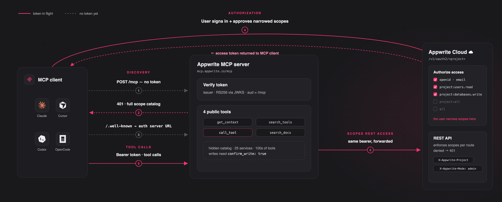
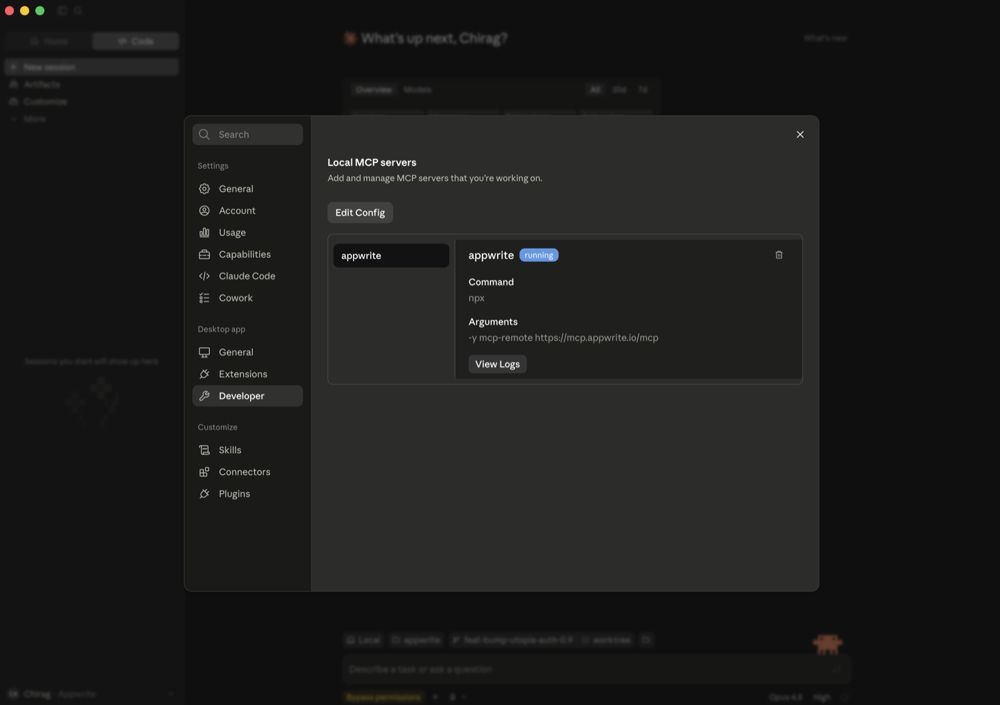
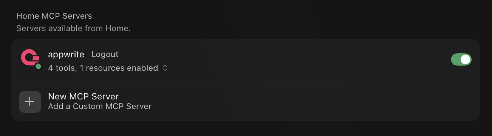
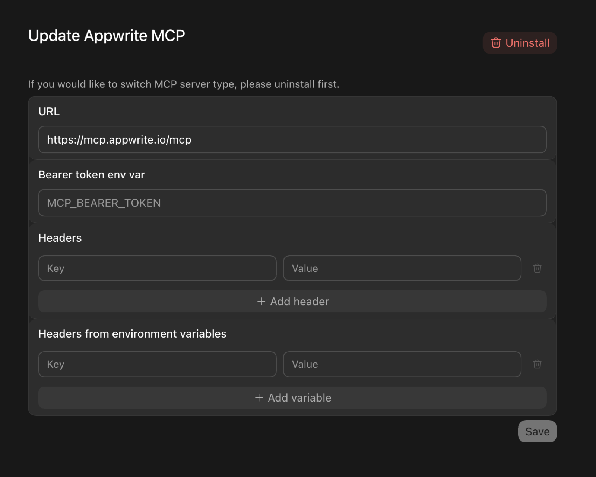

# Appwrite MCP server

mcp-name: io.github.appwrite/mcp

A [Model Context Protocol](https://modelcontextprotocol.io) server for Appwrite.
It exposes Appwrite's API — databases, users, functions, teams, storage, and more
— as tools your MCP client can call.

Connect to the hosted server at **`https://mcp.appwrite.io/mcp`** and authenticate
through your browser. The first time you connect, your client opens an Appwrite
consent screen; approve the scopes and you're connected. There are no keys to
copy.



## Connect your client

Pick your client below. Each adds the hosted Appwrite Cloud server.

<details open>
<summary><b>Claude Code</b></summary>

```bash
claude mcp add --transport http appwrite https://mcp.appwrite.io/mcp
```

Then, inside a Claude Code session, run `/mcp`, select **appwrite**, and follow
the browser prompt to authenticate.

</details>

<details>
<summary><b>Claude Desktop</b></summary>

Go to **Settings → Connectors → Add custom connector** and paste
`https://mcp.appwrite.io/mcp`. Available on Pro and Max plans; on Team and
Enterprise plans only an organization Owner can add custom connectors.

If you don't see that option (free plan, or a Team/Enterprise member), bridge
the remote server through stdio instead (requires Node.js). Go to **Settings → Developer → Local MCP servers**, click
**Edit Config**, and add:

```json
{
  "mcpServers": {
    "appwrite": {
      "command": "npx",
      "args": ["-y", "mcp-remote", "https://mcp.appwrite.io/mcp"]
    }
  }
}
```

Restart Claude Desktop; the server appears under **Local MCP servers** and a
browser window opens to authenticate.



</details>

<details>
<summary><b>Cursor</b></summary>

Edit `~/.cursor/mcp.json` (global) or `.cursor/mcp.json` (project).

```json
{
  "mcpServers": {
    "appwrite": {
      "url": "https://mcp.appwrite.io/mcp"
    }
  }
}
```

Cursor prompts you to log in through the browser; the server then shows up
under **Settings → MCP** with its tools enabled.



</details>

<details>
<summary><b>VS Code</b> (GitHub Copilot)</summary>

Edit `.vscode/mcp.json` (workspace) or your user configuration via the Command
Palette → **MCP: Open User Configuration**.

```json
{
  "servers": {
    "appwrite": {
      "type": "http",
      "url": "https://mcp.appwrite.io/mcp"
    }
  }
}
```

</details>

<details>
<summary><b>Codex</b></summary>

Edit `~/.codex/config.toml`.

```toml
[mcp_servers.appwrite]
url = "https://mcp.appwrite.io/mcp"
```

Then authenticate from the terminal:

```bash
codex mcp login appwrite
```

In the Codex GUI, you can instead add the server from the MCP settings —
set the URL to `https://mcp.appwrite.io/mcp` and leave the token and header
fields empty (authentication happens through the browser):



</details>

<details>
<summary><b>OpenCode</b></summary>

Edit `opencode.json` (project) or `~/.config/opencode/opencode.json` (global).

```json
{
  "$schema": "https://opencode.ai/config.json",
  "mcp": {
    "appwrite": {
      "type": "remote",
      "url": "https://mcp.appwrite.io/mcp",
      "enabled": true
    }
  }
}
```

</details>

<details>
<summary><b>Windsurf</b></summary>

Edit `~/.codeium/windsurf/mcp_config.json`.

```json
{
  "mcpServers": {
    "appwrite": {
      "serverUrl": "https://mcp.appwrite.io/mcp"
    }
  }
}
```

</details>

<details>
<summary><b>Gemini CLI</b></summary>

```bash
gemini mcp add --transport http appwrite https://mcp.appwrite.io/mcp
```

Or edit `~/.gemini/settings.json` (note the key is `httpUrl`, not `url`):

```json
{
  "mcpServers": {
    "appwrite": {
      "httpUrl": "https://mcp.appwrite.io/mcp"
    }
  }
}
```

Gemini CLI opens the browser OAuth flow automatically on first connect. To
re-authenticate, run `/mcp auth appwrite` inside a session.

</details>

<details>
<summary><b>Antigravity (CLI & 2.0)</b></summary>

Edit `~/.gemini/config/mcp_config.json` (global) or `.agents/mcp_config.json` (project workspace).

```json
{
  "mcpServers": {
    "appwrite": {
      "serverUrl": "https://mcp.appwrite.io/mcp"
    }
  }
}
```

> ⚠️ **Note:** Antigravity strictly requires the `serverUrl` key for remote transport. Using legacy fields like `url` or `httpUrl` will cause tool registration to fail silently.

Antigravity opens the browser OAuth flow automatically on first connect. If you manually edit the JSON file, navigate to **Settings → Customizations → Installed MCP Servers** and click **Refresh** to reload the tool definitions.

</details>

<details>
<summary><b>GitHub Copilot CLI</b></summary>

```bash
copilot mcp add --transport http appwrite https://mcp.appwrite.io/mcp
```

Or run `/mcp add` inside a session, or edit `~/.copilot/mcp-config.json`:

```json
{
  "mcpServers": {
    "appwrite": {
      "type": "http",
      "url": "https://mcp.appwrite.io/mcp"
    }
  }
}
```

A browser window opens to authenticate on first connect. Check status with
`/mcp`.

</details>

<details>
<summary><b>Zed</b></summary>

Go to **Settings → AI → MCP Servers → Add Server → Add Remote Server**, or add
to your `settings.json` (`zed: open settings`):

```json
{
  "context_servers": {
    "appwrite": {
      "url": "https://mcp.appwrite.io/mcp"
    }
  }
}
```

Zed prompts you to authenticate through the browser on first connect.

</details>

<details>
<summary><b>Warp</b></summary>

Go to **Settings → Agents → MCP servers → + Add**, choose the URL-based
server type, and enter `https://mcp.appwrite.io/mcp`.

Warp opens a browser window to authenticate on first connect.

</details>

<details>
<summary><b>JetBrains AI Assistant / Junie</b></summary>

JetBrains IDEs don't yet support OAuth for remote MCP servers, so bridge
through stdio (requires Node.js). Go to **Settings → Tools → AI Assistant →
Model Context Protocol (MCP) → Add**, switch to the JSON view, and paste:

```json
{
  "mcpServers": {
    "appwrite": {
      "command": "npx",
      "args": ["-y", "mcp-remote", "https://mcp.appwrite.io/mcp"]
    }
  }
}
```

A browser window opens to authenticate on first connect.

</details>

<details>
<summary><b>Cline</b></summary>

Cline doesn't yet support OAuth for remote MCP servers, so bridge through
stdio (requires Node.js). In the Cline panel, open the **MCP Servers** icon →
**Configure** tab → **Configure MCP Servers**, and add:

```json
{
  "mcpServers": {
    "appwrite": {
      "command": "npx",
      "args": ["-y", "mcp-remote", "https://mcp.appwrite.io/mcp"]
    }
  }
}
```

A browser window opens to authenticate on first connect.

</details>

## Self-hosted Appwrite

Running your own Appwrite instance? Run the MCP server locally over `stdio` and
authenticate with a project API key. See [docs/self-hosted.md](docs/self-hosted.md)
for per-client setup.

## Documentation

- [Tool surface](docs/tool-surface.md) — the tools exposed to the model and the
  internal Appwrite catalog.
- [How Cloud authentication works](docs/authentication.md) — the OAuth 2.1 flow.
- [Documentation search](docs/documentation-search.md) — the in-process
  `appwrite_search_docs` tool and how to rebuild its index.
- [Self-hosted Appwrite](docs/self-hosted.md) — run the server locally with a
  project API key.
- [Local development](docs/development.md) — running, testing, and debugging the
  server locally.
- [AGENTS.md](AGENTS.md) — full contributor guide and pre-PR checklist.

## License

This MCP server is licensed under the MIT License. See the [LICENSE](LICENSE) file
for details.
