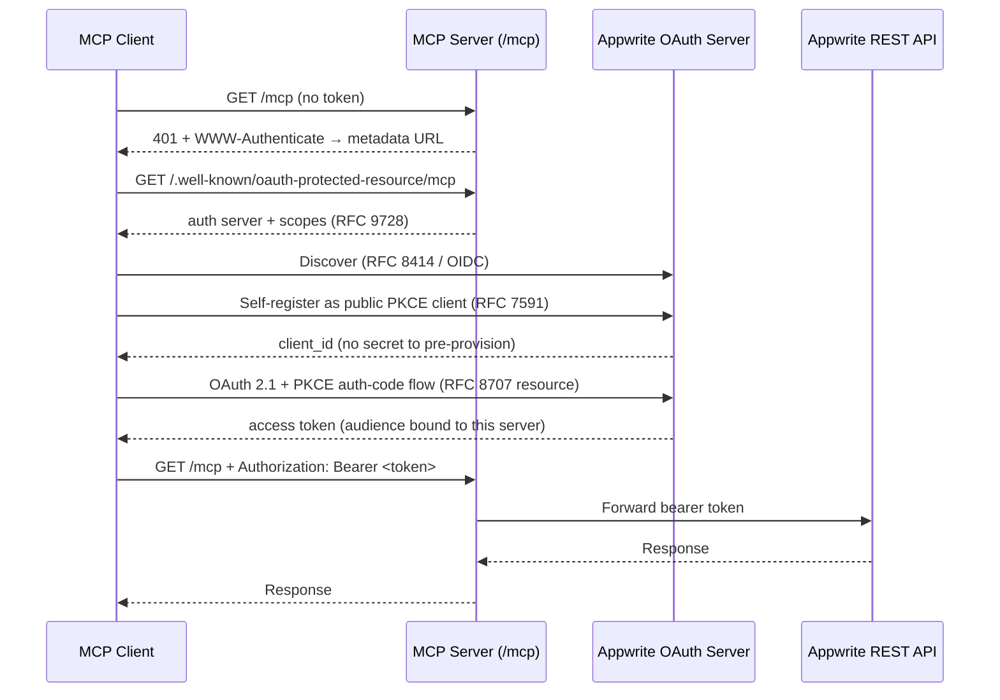

# How Cloud authentication works

Appwrite Cloud is a hosted
[OAuth 2.1 Resource Server](https://modelcontextprotocol.io/specification/2025-06-18/basic/authorization)
served over MCP
[Streamable HTTP](https://modelcontextprotocol.io/specification/2025-06-18/basic/transports).
On every request it validates the client's bearer token and forwards it to the
Appwrite REST API, which accepts the OAuth2 access token directly.

## The flow

MCP-aware clients run this automatically:

## Standards in play

| Step | Standard | Purpose |
| --- | --- | --- |
| Protected-resource metadata | RFC 9728 | Points the client at the auth server (`<APPWRITE_ENDPOINT>/oauth2/console`) and scopes |
| Auth-server discovery | RFC 8414 / OIDC | Locates token & registration endpoints |
| Dynamic client registration | RFC 7591 | Open `registration_endpoint` → no client ID/secret to pre-provision |
| Authorization-code + PKCE | OAuth 2.1 | Secure token issuance for public clients |
| Resource indicator | RFC 8707 | Binds token audience to this server |
