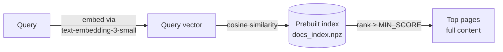
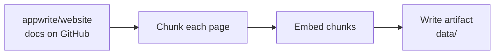

# Documentation search

`appwrite_search_docs` runs semantic search over the Appwrite documentation
entirely in-process (replacing the standalone docs MCP server). It needs no
`project_id`.



The index is a small committed artifact under `src/mcp_server_appwrite/data/`
(`docs_index.npz` + `docs_index_meta.json`), shipped in the image. The tool
registers **only** when both the artifact and `OPENAI_API_KEY` are available;
otherwise the server boots without it.

## Runtime configuration

| Variable | Required | Default | Purpose |
| --- | --- | --- | --- |
| `OPENAI_API_KEY` | Yes | — | Embeds each incoming query (one OpenAI call per search). |
| `DOCS_SEARCH_MIN_SCORE` | No | `0.25` | Minimum cosine score for a match. |
| `DOCS_SEARCH_LIMIT` | No | `5` (max `10`) | Default max pages returned. |

## Rebuilding the index

Re-run when the docs change, then commit the refreshed artifact:

```bash
OPENAI_API_KEY=sk-... uv run python scripts/build_docs_index.py
```



Optional build env vars:

| Variable | Default | Purpose |
| --- | --- | --- |
| `DOCS_WEBSITE_REF` | `main` | Git ref to pull docs from. |
| `DOCS_EMBED_BATCH` | `100` | Embedding batch size. |
