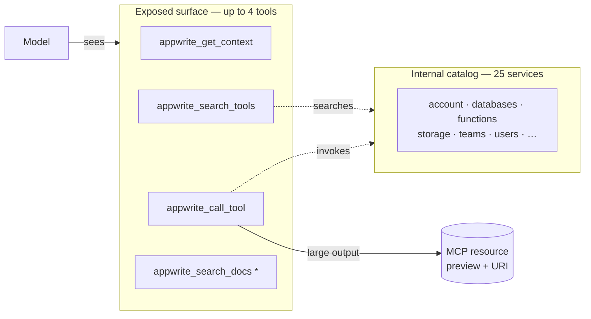

# Tool surface

The server boots in a compact workflow: the MCP client sees a small
operator-style surface while the full Appwrite catalog stays internal and is
searched at runtime.

`*` `appwrite_search_docs` is registered only when the docs index **and**
`OPENAI_API_KEY` are present — see [Documentation search](documentation-search.md).

## Exposed tools

| Tool | What it does |
| --- | --- |
| `appwrite_get_context` | Workspace summary. API key → project + readable service totals/samples. OAuth → also account, organization, discovered projects. |
| `appwrite_search_tools` | Searches the internal catalog at runtime. |
| `appwrite_call_tool` | Invokes a catalog tool. Mutating calls require `confirm_write=true`. |
| `appwrite_search_docs` | Semantic search over Appwrite docs (conditional — see above). |

## Behavior

| Concern | Rule |
| --- | --- |
| Large outputs | Stored as an MCP resource; returned as preview text + resource URI. |
| Writes | Hidden mutating tools require `confirm_write=true`. |
| Access control | Gated per-route by the scopes the OAuth token was granted — **not** by the catalog. |
| Registration | Every service the installed SDK ships is registered automatically. |
