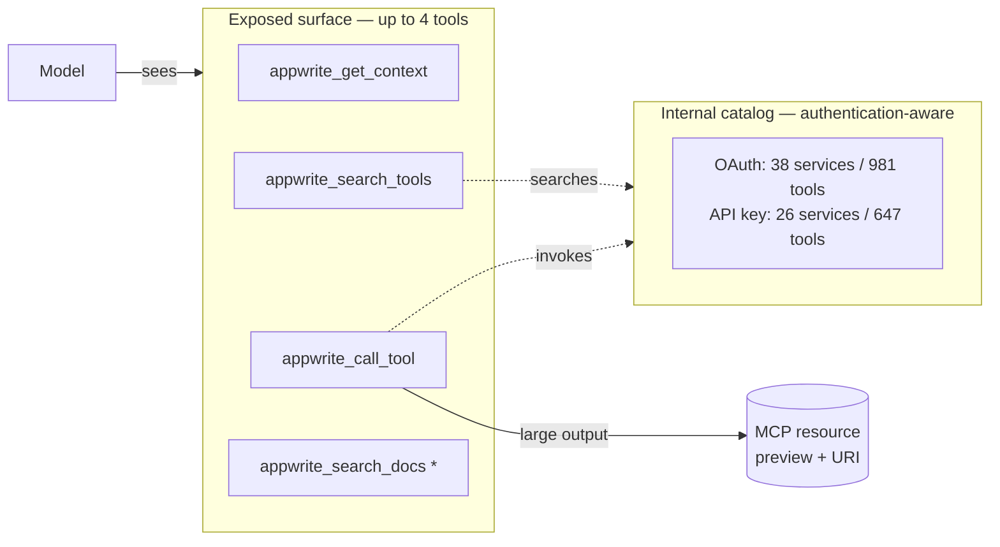

# Tool surface

The server boots in a compact workflow: the MCP client sees a small
operator-style surface while the full Appwrite catalog stays internal and is
searched at runtime.

```mermaid
flowchart LR
    M[Model] -->|sees| E

    subgraph E[Exposed surface — up to 4 tools]
        C[appwrite_get_context]
        ST[appwrite_search_tools]
        CT[appwrite_call_tool]
        SD[appwrite_search_docs *]
    end

    ST -.searches.-> CAT
    CT -.invokes.-> CAT

    subgraph CAT[Internal catalog — authentication-aware]
        direction LR
        K[OAuth: 38 services / 981 tools<br/>API key: 26 services / 647 tools]
    end

    CT -->|large output| R[(MCP resource<br/>preview + URI)]
```

`*` `appwrite_search_docs` is registered only when the docs index **and**
`OPENAI_API_KEY` are present — see [Documentation search](documentation-search.md).

## Exposed tools

| Tool | What it does |
| --- | --- |
| `appwrite_get_context` | Workspace summary. API key → project + readable service totals/samples. OAuth → also account, organization, discovered projects. |
| `appwrite_search_tools` | Searches the internal catalog at runtime. |
| `appwrite_call_tool` | Invokes a catalog tool. Mutating calls require `confirm_write=true`. |
| `appwrite_search_docs` | Semantic search over Appwrite docs (conditional — see above). |

## Behavior

- **Large outputs** are stored as an MCP resource and returned as preview text
  plus a resource URI.
- **Writes** through hidden mutating tools require `confirm_write=true`.
- **Target context** is included in search results as `context=console`,
  `context=organization`, or `context=project`. Hosted calls enforce the required
  top-level `organization_id` or `project_id` before making a request.
- **Access** is still gated per-route by the scopes granted to the OAuth token.
- **Hosted OAuth** registers all 38 services and 981 methods shipped by
  `appwrite-console` 0.2.1. This adds console control-plane services including
  projects, organizations, domains, migrations, dedicated databases, usage, VCS,
  vectors, WAF, notifications, and regions.
- **API-key stdio** deliberately registers only the 647 project-key-compatible
  methods across 26 services. It includes the new DocumentsDB, VectorsDB, and
  text-embeddings APIs, while console administration methods remain hidden.
- **Registration** remains SDK-driven, with the authentication profile policy
  applied while the internal catalog is built.
